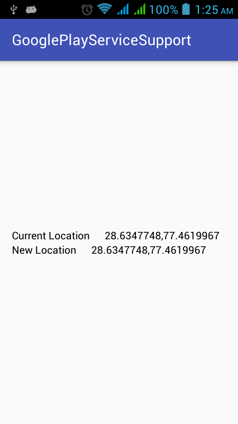
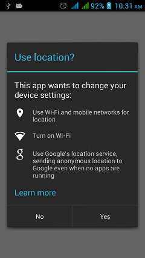
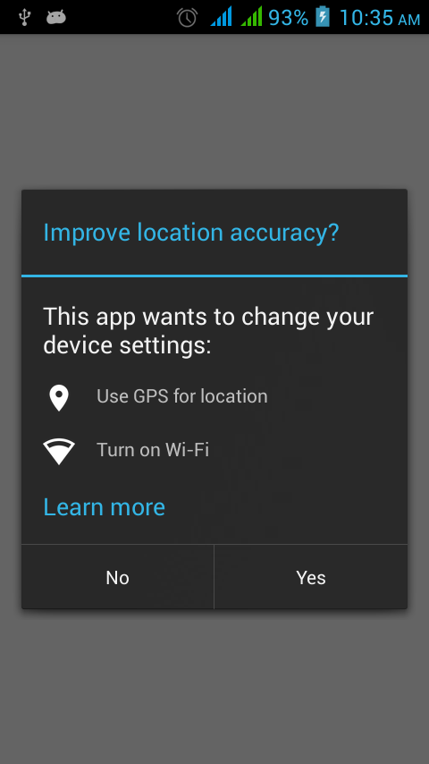
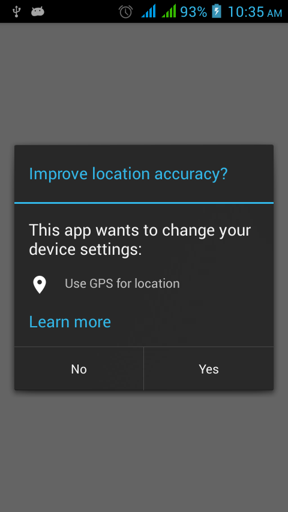

# GooglePlayServiceLocationSupport
This library is used to handle location requests and maintains the flow with permission checks in marshmallow.

[](https://android-arsenal.com/details/1/2939)

[  ](https://bintray.com/akashandroid90/maven/google-support-location/_latestVersion)

<a href='https://bintray.com/akashandroid90/maven/google-support-location/view?source=watch' alt='Get automatic notifications about new "google-support-location" versions'></a>





Gradle
-------------------------

```

dependencies {
    compile 'com.github.akashandroid90.googlesupport:google-support-location:1.0'
}

```

Usage
-----

for activity

```java
public class MainActivity extends AppLocationActivity {}
```
and for fragment
```java
public class LocationFragment extends AppLocationFragment {}
```

Developed By
--------------------
Akash Jain

License
-----------

```
Copyright 2015 Akash Jain

Licensed under the Apache License, Version 2.0 (the "License");
you may not use this file except in compliance with the License.
You may obtain a copy of the License at

   http://www.apache.org/licenses/LICENSE-2.0

Unless required by applicable law or agreed to in writing, software
distributed under the License is distributed on an "AS IS" BASIS,
WITHOUT WARRANTIES OR CONDITIONS OF ANY KIND, either express or implied.
See the License for the specific language governing permissions and
limitations under the License.
```
